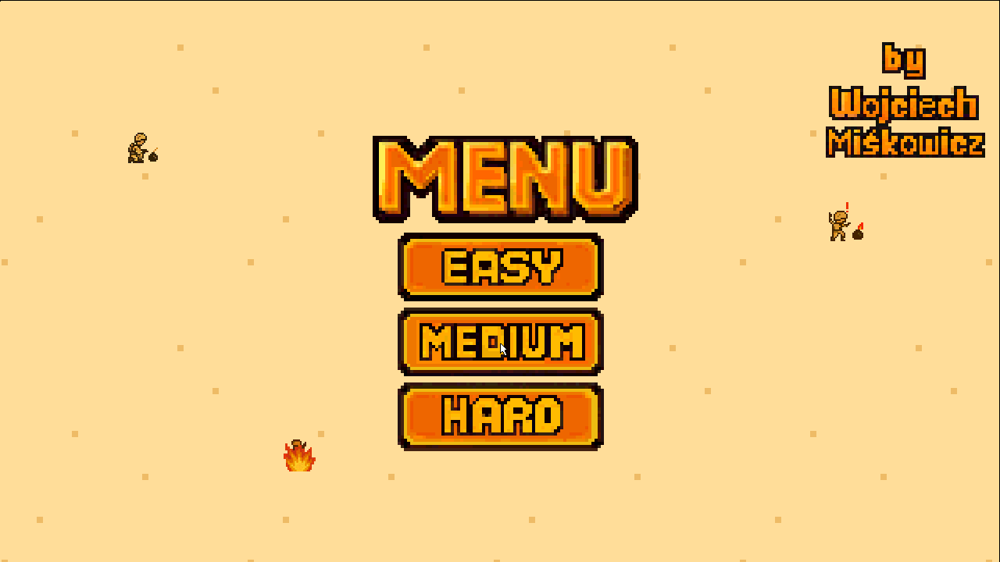
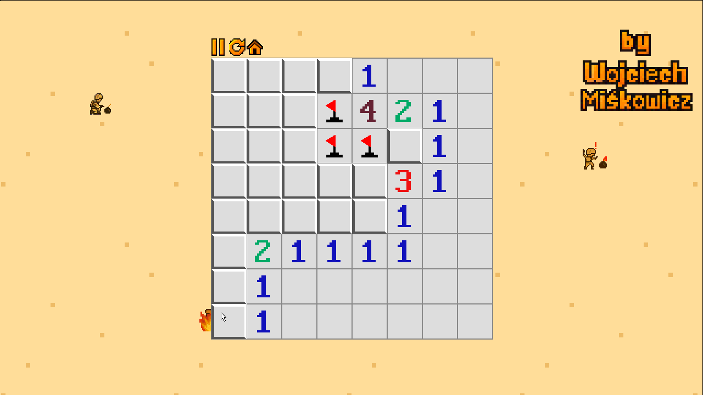
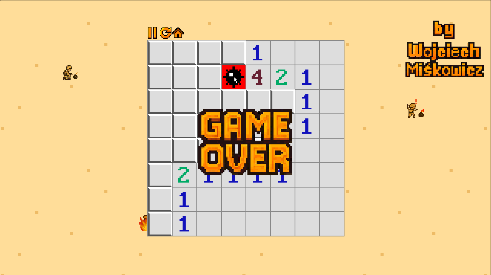
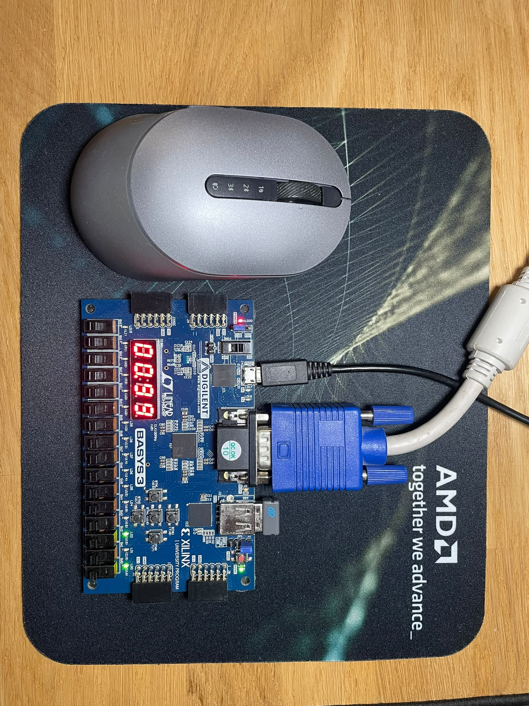
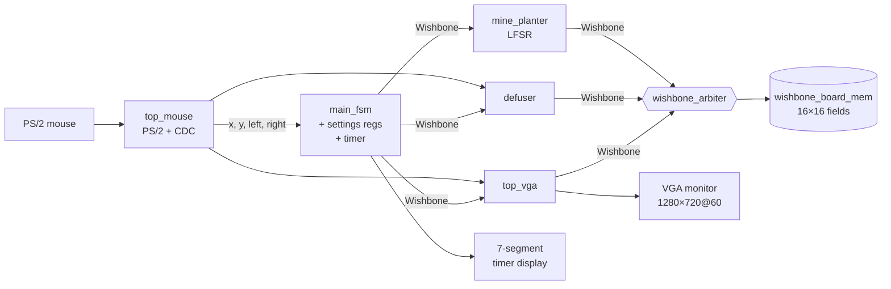
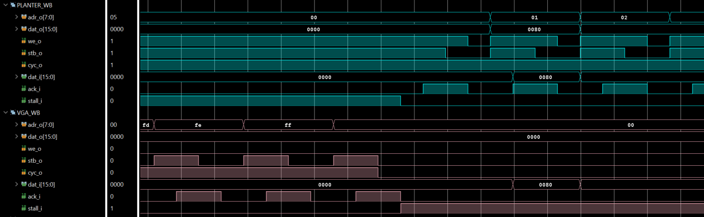
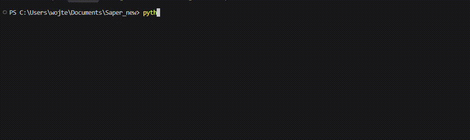

# 💣 Minesweeper in Hardware

[](https://digilent.com/reference/programmable-logic/basys-3/start)
[](https://digilent.com/reference/programmable-logic/basys-3/start)
[](#)
[](https://www.xilinx.com/products/design-tools/vivado.html)
[](https://github.com/wmiskowicz/XVUnit)

**The classic Minesweeper game, built entirely in FPGA logic, with no CPU and no software.**
It drives a 1280×720 VGA display, takes input from a PS/2 mouse and keeps the countdown on the seven-segment display. All of it runs on a Digilent Basys3 board.


<p align="center">
  
</p>

# History
After a second year of my studies we had to make a big project during a summer break.
As befits a student I started the project about 2 weeks before the deadline. In the end I made it on time,
sumbitted my [Minesweeper](https://github.com/wmiskowicz/Minesweeper-old-version) and eventually passed.  

Some time after that when I started a job as FPGA engineer I noticed how terribly this was written so based on my new skills and knowledge I decided to remake it -
that's how this project exists.

Throughout the process of creating it in my free time I again learned more and today would have done some things differently. The Minesweeper project is far from perfect but I had to wrap it up at some point :) enjoy!

P.S.  
The project was developed without agentic AI except this README (Claude Code).

---

## Contents

- [Features](#features)
- [Gallery](#gallery)
- [Architecture](#architecture)
- [Wishbone bus](#wishbone-bus)
- [VGA graphics pipeline](#vga-graphics-pipeline)
- [Verification with XVunit](#verification-with-xvunit)
- [Vivado toolchain](#vivado-toolchain)
- [Getting started](#getting-started)
- [Repository layout](#repository-layout)
- [Credits](#credits)

---

## Features

- 🎮 **Full game loop in hardware:** an intro banner, a level menu, gameplay, pause, win and lose screens, and retry or back-to-menu.
- 🧩 **Three difficulty levels:**

  | Level  | Board | Mines | Time limit |
  |--------|:-----:|:-----:|:----------:|
  | Easy   | 6×6   | 7     | 60 s       |
  | Medium | 8×8   | 10    | 85 s       |
  | Hard   | 10×10 | 17    | 99 s       |

- 🎲 **Random mine placement** from an LFSR, using polynomials from Xilinx XAPP052.
- 🌊 **Flood-fill reveal in hardware:** opening an empty field automatically opens its whole empty neighbourhood.
- 🚩 **Flags** with the right mouse button. Neighbouring-mine counters are computed on the FPGA.
- ⏱️ **Countdown timer** on the seven-segment display. It shows milliseconds during the last 10 seconds.
- 🖥️ **720p VGA output** at 60 Hz, with sprites, a bitmap font and an animated background.
- 🔌 **Custom Wishbone interconnect** between game logic, board memory and the renderer.
- ✅ **Unit-tested** with my other project [XVunit](https://github.com/wmiskowicz/XVUnit), VUnit-style testbenches running on Vivado XSim.
- ⚙️ **One-command build and programming** through a Python wrapper around Vivado in batch mode.

---

## Gallery

| Menu | Gameplay | Game over |
|:----:|:--------:|:---------:|
|  |  |  |


<p align="center">
  
</p>

---

## Architecture




| Block | Location | Role |
|-------|----------|------|
| `top_basys3` | [fpga/rtl/top_basys3.sv](fpga/rtl/top_basys3.sv) | Board top level. Holds the clocking wizard (100 MHz → 74.25 MHz pixel clock) and wires everything together. |
| `main_fsm` | [rtl/z_game_setup/main_fsm.sv](rtl/z_game_setup/main_fsm.sv) | Game state machine (BANNER → MENU → PLAY ⇄ PAUSE → WIN/LOST → GAME_OVER). Also acts as a Wishbone slave that serves the level settings and win/loss statistics. |
| `mine_planter` | [rtl/z_game_setup/mine_planter.sv](rtl/z_game_setup/mine_planter.sv) | Places mines at random and writes the board through Wishbone. |
| `defuser` | [rtl/z_game_setup/defuser.sv](rtl/z_game_setup/defuser.sv) | Gameplay engine: handles clicks, flags, neighbour counters and flood-fill, and detects a win or loss. |
| `top_memory` | [rtl/memory/](rtl/memory/) | Board RAM behind a priority Wishbone arbiter. |
| `top_vga` | [rtl/top_vga/](rtl/top_vga/) | Rendering pipeline (see below). |
| `top_mouse` | [rtl/mouse/](rtl/mouse/) | PS/2 mouse controller and a clock-domain crossing into the pixel clock domain. |
| `top_timer` | [rtl/timer/](rtl/timer/) | Countdown timer with BCD conversion for the seven-segment display. |

---

## Wishbone bus

All modules exchange data over a **Wishbone-style bus** built on a SystemVerilog `interface` with `master` and `slave` modports ([wishbone_if.sv](rtl/memory/wishbone_if.sv)). It has 16-bit data, 8-bit addresses, and `cyc`/`stb`/`we`/`ack`/`stall` handshaking.

There are two independent buses:

1. **Settings bus.** `main_fsm` acts as a slave with 9 registers: board size, mine count, time limit, field size, board position, and games won/lost. The planter, the defuser and the renderer each read them through a dedicated port.
2. **Board bus.** Three masters share one board memory. The [arbiter](rtl/memory/wishbone_arbiter.sv) uses fixed priority: the mine planter, then the defuser, then the VGA reader. A master keeps the bus until it drops `cyc`.

Each board field is a packed struct ([wishbone_defs.svh](rtl/memory/wishbone_defs.svh)) holding `mine`, `flag`, `defused` and a 4-bit neighbour counter. The address is simply `{row, col}`.

A reusable [wishbone_master](rtl/memory/wishbone_master.sv) turns the bus protocol into simple `read_en`/`write_en` ports, so game modules don't have to implement the handshake themselves.



---

## VGA graphics pipeline

The display runs at **1280×720 @ 60 Hz** with a 74.25 MHz pixel clock (timings from VESA DMT, see [doc/](doc/)). Each frame passes through a chain of drawing stages. Every stage gets timing and RGB on a `vga_if` interface and overlays its own layer:

```
vga_timing → draw_bg → draw_back_objects → draw_board → writings → draw_mouse → vga_out
```

- **Sprites** (bomb, flag, banners, icons) are stored in block-RAM image ROMs as 12-bit RGB `.data` files.
- **Text** is drawn with a bitmap [font ROM](rtl/top_vga/font_rom.v).
- **Animated background** cycles through 3 frames.
- The colour palette lives in [color_pkg.sv](rtl/top_vga/color_pkg.sv), and the resolution can be changed in [vga_pkg.sv](rtl/top_vga/vga_pkg.sv).

Any image can be converted to a ROM file with the toolchain's `img2dat.py` script.


## Verification with XVunit

[VUnit](https://vunit.github.io/) doesn't support the Vivado simulator, so I wrote **[XVunit](https://github.com/wmiskowicz/XVUnit)**. It is a small Python framework that runs VUnit-style SystemVerilog testbenches directly on `xvlog`/`xelab`/`xsim`. You get `` `TEST_CASE `` and `` `CHECK_EQUAL `` macros, per-test pass/fail reporting, incremental recompilation, and an optional GUI.

The testbenches cover the main parts of the design:

| Area | Testbench | Runner |
|------|-----------|--------|
| Game FSM | [sim/main_fsm_xvunit](sim/main_fsm_xvunit/) | — |
| Mine planter | [sim/mine_planter](sim/mine_planter/) | `run_mine_planter.py` |
| Defuser | [sim/defuser_xvunit](sim/defuser_xvunit/) | — |
| Timer | [sim/timer](sim/timer/) | `run_timer.py` |
| Wishbone master / arbiter / memory | [sim/wishbone_*](sim/) | `run_wishbone.py` |
| VGA timing / output / full frame | [sim/vga_*](sim/), [sim/top_vga_xvunit](sim/top_vga_xvunit/) | `run_vga.py` |
| PS/2 mouse (with a mouse BFM) | [sim/top_mouse](sim/top_mouse/) | `run_mouse.py` |
| Whole system | [sim/top_basys3](sim/top_basys3/) | `run_top_level_sim.py` |

```sh
python run_timer.py -l              # list testbenches and test cases
python run_timer.py                 # run everything
python run_vga.py vga_out_tb.TC001  # run a single test case
python run_vga.py vga_out_tb -g     # open it in the XSim GUI
```

<p align="center">
  
</p>

---

## Vivado toolchain

The build doesn't depend on clicking through the Vivado GUI. The [`tools/`](tools/) submodule ([vivado_toolchain](https://github.com/wmiskowicz/vivado_toolchain)) provides a Python wrapper that drives Vivado in **batch/Tcl mode**:

```sh
python tools/vivado_wrapper.py -g   # scan sources, regenerate project_details.tcl, synth + impl + bitstream
python tools/vivado_wrapper.py -p   # program the Basys3 over JTAG
python tools/vivado_wrapper.py -w   # summarise warnings/critical warnings from the logs
python tools/vivado_wrapper.py -c   # clean build artefacts
```

- **No source lists to maintain by hand.** RTL (`.sv`/`.v`/`.vhd`), constraints, IP (`.xci`) and memory-init files are discovered automatically and written to [project_details.tcl](fpga/scripts/project_details.tcl).
- **Reproducible builds.** The `fpga/` build directory is cleaned before each run, and the bitstream is copied to `results/`.
- **Warning summary.** Synthesis and implementation logs are condensed into `results/warning_summary.log`.
- **Asset pipeline.** `img2dat.py` and `dat2img.py` convert between images and the 12-bit ROM format used by the renderer.

<!-- TODO (optional): GIF of `vivado_wrapper.py -g` finishing with "Bitstream generated in X min" -->

---

## Getting started

### Requirements

- Digilent **Basys3** (Artix-7 `xc7a35tcpg236-1`)
- A VGA monitor that supports 1280×720 and a **USB mouse** (the Basys3 USB-HID port presents it as PS/2)
- **Vivado 2023.1** (other versions will probably work, but I haven't tested them)
- Python 3.10+ with `colorama`, plus `Pillow` and `numpy` for the image tools

### Build and play

```sh
git clone --recursive https://github.com/wmiskowicz/Saper_new.git
cd Saper_new
pip install colorama pillow numpy

python tools/vivado_wrapper.py -g -p   # build and program the board
```

If Vivado is not installed in `C:\Xilinx\Vivado\2023.1`, set its path in [tools/project_setup.py](tools/project_setup.py).

### Controls

| Input | Action |
|-------|--------|
| Left click | Select level / reveal a field / press on-screen buttons (pause, home, retry) |
| Right click | Place or remove a flag |
| `btnD` | Reset |
| 7-segment display | Time remaining |
| LEDs 0–4 | Clock lock, time-out, current FSM state (debug) |

---

## Repository layout

```
├── rtl/            Design sources (board-independent)
│   ├── z_game_setup/   main FSM, mine planter, defuser, LFSR, game constants
│   ├── memory/         Wishbone interface, master, arbiter, board memory
│   ├── top_vga/        VGA timing, drawing stages, sprites (data/), font
│   ├── mouse/          PS/2 mouse controller + display
│   ├── timer/          countdown timer + BCD
│   └── common/         CDC buffer, delays, edge detector
├── fpga/           Basys3-specific top, clocking IP, constraints, Tcl
├── sim/            Testbenches (XVunit) and shared sim helpers
├── run_*.py        XVunit test runners
├── tools/          Vivado toolchain (submodule)
├── XVunit/         Test framework (submodule)
└── doc/            VESA timings, Wishbone spec
```

---

## Credits

- PS/2 mouse controller (`MouseCtl`, `Ps2Interface`, `MouseDisplay`): © Digilent Inc.
- `tiff_writer`, the base of the bitstream Tcl scripts and the original lab template: AGH University of Science and Technology (MTM UEC2), based on SJSU EE178 material.
- LFSR polynomial table: Xilinx XAPP052.

**Author:** Wojciech Miskowicz
